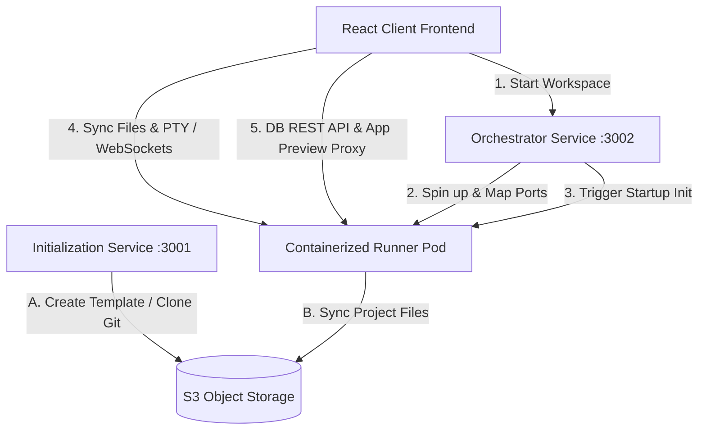

# Yuvro Online IDE — Architecture & Setup Guide

Welcome to the **Yuvro Online IDE** project! This is a state-of-the-art, containerized web IDE platform modeled after Replit. It enables users to create python/web workspaces, edit files in real-time, execute commands in an interactive terminal, preview running web applications, and view SQLite databases with a built-in DB inspector.

---

## System Architecture

Yuvro is built as a distributed microservice system comprising a React-based frontend client, a centralized Docker/workspace orchestrator, a template initialization service, and containerized runner pods.

### High-Level Components Flow



---

### Component Breakdown

#### 1. Frontend Client (`/client`)
- **Tech Stack**: React, TypeScript, Tailwind CSS, Lucide icons, Monaco Editor / custom code viewer, `socket.io-client`.
- **Purpose**: Provides a slick, dark-themed responsive IDE workspace. Includes:
  - **File Explorer**: Handles filesystem trees, creations, and deletions.
  - **Code Editor**: Monaco-powered editor with auto-save and syntax highlighting.
  - **Interactive Terminal**: An xterm.js instance connecting to the running container's bash environment.
  - **App Preview**: A sandboxed iframe showing live web applications running inside the container.
  - **Database Viewer**: A dedicated tab for inspecting SQLite databases, browsing rows, viewing columns/schema structure, and executing read-only SQL queries.

#### 2. Orchestrator Service (`/orchestrator`)
- **Tech Stack**: FastAPI, Uvicorn, Python, Docker SDK/Subprocess.
- **Purpose**: Controls runner container lifecycles on the host machine.
  - Receives request `/start` with a `replId`.
  - Spins up a dedicated Docker container `yuvro-repl-{replId}` using the `yuvro-runner:latest` image.
  - Mounts a persistent directory on the host (`workspaces/{replId}`) directly to `/workspace` inside the container.
  - Maps ports dynamically: Container port `3002` (REST API & Socket.io) and port `8000` (Web preview) map to random available host ports.
  - Performs health checks and triggers S3 downloads inside the runner before handing the connection details back to the client.

#### 3. Init-Service (`/init-service`)
- **Tech Stack**: FastAPI, Uvicorn, Python, Boto3 (S3).
- **Purpose**: Handles new project generation.
  - Copies template workspace files from S3 (`yuvro/base/{language}`) to `yuvro/code/{replId}`.
  - Supports cloning a public GitHub repository, packaging it, and uploading it to S3 as a new REPL backup.

#### 4. Containerized Runner (`/runner`)
- **Tech Stack**: FastAPI, Socket.io (ASGI), Pty, Python, SQLite3.
- **Purpose**: Runs as the host workspace agent inside the Docker container.
  - **Virtual Environment**: Automatically creates a `.venv` and installs dependencies listed in `requirements.txt` on thread startup.
  - **PTY Terminal Manager**: Handles bidirectional terminal stream forwarding between client WebSockets and container `/bin/bash`.
  - **File Syncing Manager**: Synchronizes filesystem operations (`fetchContent`, `createFile`, `deletePath`) over Socket.io.
  - **Database Viewer API**: Exposes endpoints for database operations:
    - `GET /api/db/list` — Scans `/workspace` for `.db`, `.sqlite`, `.sqlite3` databases.
    - `GET /api/db/tables` — Returns a list of tables and their row counts.
    - `GET /api/db/schema` — Inspects the schema for columns, types, primary keys, and nullability.
    - `GET /api/db/rows` — Retrieves paginated table rows.
    - `POST /api/db/query` — Runs read-only custom SQL queries.

---

## Architectural Design Diagram
Below is the visual architecture diagram drawn for this project:


*(Replace this image file path as needed once the Excalidraw design is exported to the root directory)*

---

## Setup & Installation

Follow these steps to configure and run the full stack locally.

### Prerequisites
Make sure you have the following installed on your machine:
- **macOS** or **Linux**
- **Docker Desktop** (running)
- **Node.js** (v18+) & **npm**
- **Python** (v3.10+)

---

### Step 1: Clone and Set Up Dependencies

1. **Install Frontend Dependencies**:
   ```bash
   cd client
   npm install
   ```

2. **Setup Runner Docker Image**:
   You need to build the runner container image. The orchestrator depends on this image to spawn instances:
   ```bash
   make build-runner-image
   ```
   *(Or manually run `docker build -t yuvro-runner:latest ./runner` from the root directory)*

---

### Step 2: Running the Services in Development Mode

Run the following command in the project root:
```bash
make dev
```
This launches the following services concurrently:
- **Init-Service**: running on [http://localhost:3001](http://localhost:3001)
- **Orchestrator**: running on [http://localhost:3002](http://localhost:3002)
- **Frontend Client**: running on [http://localhost:5173](http://localhost:5173)

---

### Step 3: Accessing the IDE

Open your web browser and navigate to:
```url
http://localhost:5173/coding/?replId=pleasecomputercomputer
```
Replace `pleasecomputercomputer` with any identifier you want to use for your workspace.

---

## Testing the Database Viewer

To test the SQLite Database Viewer integrated into the bottom panel of the IDE, follow these steps:

### 1. Initialize a Test Database
Create a test database inside the workspace directory (`workspaces/pleasecomputercomputer/test.db`). You can run our helper script to set up sample tables (`users` and `tasks`) automatically:
```bash
# From the root directory:
cd workspaces/pleasecomputercomputer
python3 create_db.py
```

### 2. Connect in the IDE
- Open the IDE workspace in your browser: `http://localhost:5173/coding/?replId=pleasecomputercomputer`.
- Click on the **Database Viewer** tab at the bottom.
- Click the **Scan Workspace** button or the Refresh icon to discover the new database.
- Select `test.db` from the dropdown list.

### 3. Verify Functionality
- **Browse Data**: Click on any discovered table in the sidebar (e.g. `users` or `tasks`) to display rows in the data grid.
- **Schema**: Switch to the **Schema** tab to inspect columns, types, primary keys, and nullable fields.
- **Query Console**: Go to the **Query Console** tab, type a read-only query like `SELECT * FROM users WHERE role = 'developer';` and hit **Execute** to view output.

---

> [!NOTE]
> All custom queries in the Database Viewer are run in read-only mode. Destructive actions (`INSERT`, `UPDATE`, `DELETE`, `DROP`, `CREATE`, etc.) are blocked at the runner API level to prevent unintended schema modifications or data loss inside the browser console.

---

## Demo Video

Below is a screen recording demonstrating the platform's workspace initialization, terminal execution, and the interactive SQLite database viewer:


*(Replace this video file path or embed link as needed once your walkthrough video is saved)*

