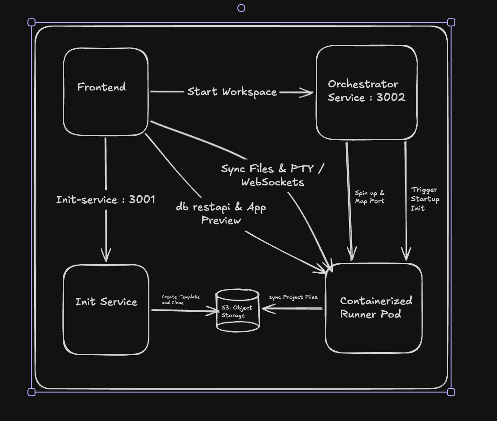

# Yuvro Online IDE — Architecture & Setup Guide

Welcome to the **Yuvro Online IDE** project! This is a state-of-the-art, containerized web IDE platform modeled after Replit. It enables users to create python/web workspaces, edit files in real-time, execute commands in an interactive terminal, preview running web applications, and view SQLite databases with a built-in DB inspector.

---

## System Architecture

Yuvro is built as a distributed microservice system comprising a React-based frontend client, a centralized Docker/workspace orchestrator, a template initialization service, and containerized runner pods.

### High-Level Components Flow



---

### Component Breakdown

#### 1. Frontend Client (`/client`)
- **Tech Stack**: React, TypeScript, Tailwind CSS, Lucide icons, Monaco Editor / custom code viewer, `socket.io-client`.
- **Purpose**: Provides a slick, dark-themed responsive IDE workspace. Includes:
  - **File Explorer**: Handles filesystem trees, creations, and deletions.
  - **Code Editor**: Monaco-powered editor with auto-save and syntax highlighting.
  - **Interactive Terminal**: An xterm.js instance connecting to the running container's bash environment.
  - **App Preview**: A sandboxed iframe showing live web applications running inside the container.
  - **Database Viewer**: A modular panel under `client/src/components/ide/database/` supporting SQLite, PostgreSQL, and MySQL. Enables users to connect to existing databases or provision a local Docker DB container dynamically, scan tables, browse rows, inspect schemas, and execute read-only queries.

#### 2. Orchestrator Service (`/orchestrator`)
- **Tech Stack**: FastAPI, Uvicorn, Python, Docker SDK/Subprocess.
- **Purpose**: Controls runner and database container lifecycles on the host machine.
  - Receives request `/start` with a `replId`, establishes a project-specific Docker bridge network `yuvro-net-{replId}`, and spins up the runner container `yuvro-repl-{replId}`.
  - Mounts a persistent directory on the host (`workspaces/{replId}`) directly to `/workspace` inside the container.
  - Exposes `POST /db/start` to provision database containers (Postgres/MySQL) on demand inside the same project bridge network, mapping a persistent data directory (`workspaces/{replId}/.db_data`).
  - Manages cascading container cleanups so that stopping a workspace container automatically purges the associated database container and bridge network.
  - Runs a background garbage collector loop to prune orphaned database containers.

#### 3. Init-Service (`/init-service`)
- **Tech Stack**: FastAPI, Uvicorn, Python, Boto3 (S3).
- **Purpose**: Handles new project generation.
  - Copies template workspace files from S3 (`yuvro/base/{language}`) to `yuvro/code/{replId}`.
  - Supports cloning a public GitHub repository, packaging it, and uploading it to S3 as a new REPL backup.

#### 4. Containerized Runner (`/runner`)
- **Tech Stack**: FastAPI, Socket.io (ASGI), Pty, Python, SQLite3, PyMySQL, Psycopg2.
- **Purpose**: Runs as the host workspace agent inside the Docker container.
  - **Virtual Environment**: Automatically creates a `.venv` and installs dependencies listed in `requirements.txt` on thread startup.
  - **PTY Terminal Manager**: Handles bidirectional terminal stream forwarding between client WebSockets and container `/bin/bash`.
  - **File Syncing Manager**: Synchronizes filesystem operations (`fetchContent`, `createFile`, `deletePath`) over Socket.io.
  - **Database Viewer API & Engine Adapters**: Integrates engine-specific connection adapters (`SQLiteAdapter`, `PostgresAdapter`, `MySQLAdapter`) to interact with databases. Exposes endpoints for connection listing, table list fetching, row retrieval, schema inspection, and custom query execution. Saves manual DB connection profiles to `/workspace/.yuvro/db_connections.json`.

---

## Setup & Installation

Follow these steps to configure and run the full stack locally.

### Prerequisites
Make sure you have the following installed on your machine:
- **macOS** or **Linux**
- **Docker Desktop** (must be active and running)
- **Node.js** (v18+) & **npm**
- **Python** (v3.10+)

---

## Step-by-Step Setup Guide

Here is how to set up each component of the stack individually, followed by how to run them easily using `make`.

### 1. Frontend Client Setup (React)
The frontend is built with React, Vite, and Tailwind CSS.
```bash
# Navigate to the client directory
cd client

# Install dependencies
npm install

# (Optional) To start the frontend server individually
npm run dev
# Starts at http://localhost:5173
```

### 2. Init-Service Setup (FastAPI Backend)
The template generation and repository cloning backend.
```bash
# Navigate to the init-service directory
cd init-service

# Create a Python virtual environment
python3 -m venv .venv

# Activate the virtual environment
source .venv/bin/activate

# Install the required Python packages
pip install -r requirements.txt

# (Optional) To start the init-service individually
uvicorn app.main:app --host 0.0.0.0 --port 3001 --reload
# Starts at http://localhost:3001
```

For OAuth locally, configure these init-service environment variables in `init-service/.env` before starting the backend:
```env
CLIENT_ORIGINS=http://localhost:5173
PUBLIC_BASE_URL=http://localhost:3001
AUTH_SECRET_KEY=replace-with-a-long-random-secret
GOOGLE_CLIENT_ID=
GOOGLE_CLIENT_SECRET=
GITHUB_CLIENT_ID=
GITHUB_CLIENT_SECRET=
```
Google callback URL: `http://localhost:3001/auth/google/callback`
GitHub callback URL: `http://localhost:3001/auth/github/callback`

### 3. Orchestrator Setup (FastAPI Backend)
The container lifecycle manager which interfaces with Docker.
```bash
# Navigate to the orchestrator directory
cd orchestrator

# Create a Python virtual environment
python3 -m venv .venv

# Activate the virtual environment
source .venv/bin/activate

# Install the required Python packages
pip install -r requirements.txt

# (Optional) To start the orchestrator individually
uvicorn app.main:app --host 0.0.0.0 --port 3002 --reload
# Starts at http://localhost:3002
```

### 4. Runner Container Image Setup
The agent running inside the workspace Docker containers. You must build this image locally before launching a workspace.
```bash
# From the root directory, build the runner Docker image
docker build -t yuvro-runner:latest ./runner

# Alternatively, you can use the Makefile shortcut:
make build-runner-image
```

---

## Running the Platform

Once the individual setups/virtual environments are ready:

### Option A: Run Concurrently (Recommended)
You can start all three main servers (Frontend client, Orchestrator, Init-Service) concurrently with a single command from the root directory:
```bash
make dev
```
This runs:
- **Init-Service** on [http://localhost:3001](http://localhost:3001)
- **Orchestrator** on [http://localhost:3002](http://localhost:3002)
- **Frontend Client** on [http://localhost:5173](http://localhost:5173)

### Option B: Run Manually (Separate Terminals)
Open three terminal tabs and start each service manually using the commands detailed in sections 1, 2, and 3 above.

---

### Step 5: Accessing the IDE

Open your web browser and navigate to:
```url
http://localhost:5173/coding/?replId=pleasecomputercomputer
```
Replace `pleasecomputercomputer` with any identifier you want to use for your workspace.

---

## Testing the Database Viewer

You can test SQLite databases directly inside the workspace, or dynamically provision local PostgreSQL and MySQL Docker containers:

### 1. SQLite Database Testing
1. **Initialize a Test Database**:
   Create a test database inside the workspace directory (`workspaces/pleasecomputercomputer/test.db`). You can run our helper script to set up sample tables (`users` and `tasks`) automatically:
   ```bash
   # From the root directory:
   cd workspaces/pleasecomputercomputer
   python3 create_db.py
   ```
2. **Connect in the IDE**:
   - Open the IDE workspace in your browser: `http://localhost:5173/coding/?replId=pleasecomputercomputer`.
   - Click on the **Database Viewer** tab at the bottom.
   - Click the **Scan Workspace** button or the Refresh icon to discover the new database.
   - Select `test.db` from the dropdown list.

### 2. Postgres / MySQL Docker Container Provisioning
1. **Open the DB Connection Modal**:
   - Click the **"+" (Add Connection)** button on the Database Viewer sidebar.
2. **Provision a Local Container**:
   - Choose **Postgres** or **MySQL** as the Engine.
   - Click **"Provision local Docker Container"**.
   - The orchestrator will spin up the database container on a secure project network bridge, configure it, and register the profile with the runner.
   - Once ready, the modal will close automatically, the databases dropdown will focus the newly provisioned connection, and you can begin browsing tables, schema, or running queries!

---

> [!NOTE]
> All custom queries in the Database Viewer are run in read-only mode. Destructive actions (`INSERT`, `UPDATE`, `DELETE`, `DROP`, `CREATE`, etc.) are blocked at the runner API level to prevent unintended schema modifications or data loss inside the browser console.

---

## Demo Video

Below is a screen recording demonstrating the platform's workspace initialization, terminal execution, and the interactive SQLite database viewer:

[Watch the Demo Video on Google Drive](https://drive.google.com/file/d/1--Tg6yNgQp1A2IOS2h6R4wI5CgFyHUav/view?usp=sharing)
